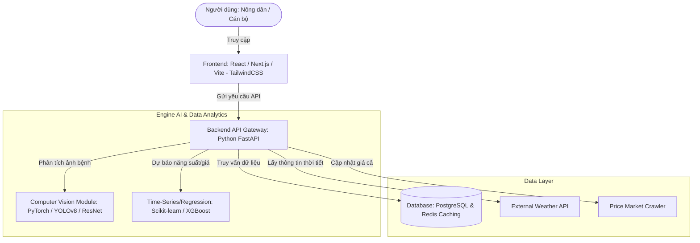

# 1.1 Phân tích Chi tiết Yêu cầu Đề bài - Dự án ArgiAI

## 1. Tổng quan Dự án (Project Overview)
- **Tên dự án**: **ArgiAI** (Trí tuệ nhân tạo hỗ trợ nông nghiệp tỉnh Điện Biên)
- **Bối cảnh**: 
  - Điện Biên là tỉnh miền núi có thế mạnh về nông nghiệp với các cây trồng chủ lực đặc sản: **Gạo Điện Biên**, **Cà phê Mường Ảng**, và các loại **Rau vụ đông**.
  - Quy trình quản lý hiện tại chủ yếu là thủ công: thu thập thông tin bằng tay, thiếu công cụ phân tích để phát hiện bệnh sớm, dự báo sản lượng và đưa ra các khuyến nghị canh tác/thu hoạch tối ưu.
  - Các báo cáo so sánh định kỳ (quý/năm) được thực hiện thủ công, tốn thời gian và dễ bỏ sót các xu hướng quan trọng.
- **Mục tiêu**: Xây dựng một ứng dụng AI toàn diện hỗ trợ hai đối tượng chính: **Cán bộ quản lý nông nghiệp (Officials)** và **Người nông dân (Farmers)** qua 4 nhóm chức năng cốt lõi.

---

## 2. Phân tích Chi tiết 4 Phân hệ Chức năng Cốt lõi

| STT | Phân hệ chức năng | Mô tả yêu cầu | Đối tượng sử dụng | Đầu vào dữ liệu (Input) | Xử lý AI/Phân tích (Processing) | Đầu ra mong muốn (Output) |
| :--- | :--- | :--- | :--- | :--- | :--- | :--- |
| **1** | **Phát hiện dịch bệnh cây trồng** *(Crop Disease Detection)* | Nhận diện bệnh hại trên cây từ hình ảnh thực tế và đưa ra giải pháp điều trị. | Nông dân | Ảnh chụp lá hoặc thân cây bị bệnh từ điện thoại. | Phân loại ảnh (Image Classification) / Phát hiện vật thể (Object Detection). | Tên bệnh/sâu hại và biện pháp xử lý cụ thể (canh tác, sinh học, hóa học). |
| **2** | **Dự báo năng suất & Hoạch định thu hoạch** *(Yield Forecasting & Harvest Planning)* | Ước lượng sản lượng thu hoạch và xác định thời điểm cắt/hái tối ưu. | Cán bộ & Nông dân | Diện tích canh tác, giống cây, thời tiết hiện tại/dự báo, lịch sử mùa vụ. | Mô hình dự báo số liệu (Regression/Time-series) kết hợp chu kỳ sinh trưởng cây trồng. | Dự báo sản lượng (tấn/ha), khuyến nghị ngày thu hoạch tối ưu để đạt chất lượng tốt nhất. |
| **3** | **Phân tích giá thị trường** *(Market Price Analysis)* | Cung cấp thông tin giá cả nông sản trực quan để đưa ra quyết định thương mại. | Cán bộ & Nông dân | Dữ liệu giá cả thị trường (lịch sử và thời gian thực). | Phân tích xu hướng biến động giá (Price Trend Analysis). | Biểu đồ trực quan, khuyến nghị thời điểm bán có lợi nhất để tránh ép giá. |
| **4** | **Báo cáo so sánh chu kỳ** *(Period-Comparison Dashboard)* | Dashboard quản trị tự động hóa so sánh dữ liệu qua các mốc thời gian. | Cán bộ quản lý | Dữ liệu tổng hợp về sản lượng, diện tích gieo trồng, và tình hình dịch bệnh qua các thời kỳ. | Kết hợp & tổng hợp dữ liệu (Data Aggregation & BI Analysis). | Biểu đồ trực quan so sánh theo Quý (QoQ) và so với cùng kỳ năm trước (YoY). |

---

## 3. Phân tích Yêu cầu Kỹ thuật & Phi chức năng

### 3.1. Trải nghiệm người dùng (UX/UI)
- **Ứng dụng cho Nông dân (Mobile-friendly)**: Giao diện trực quan, nút bấm to rõ ràng, thao tác chụp ảnh và gửi dữ liệu tối giản (one-tap). Chức năng xem biểu đồ giá cần dễ hiểu, tránh thuật ngữ kỹ thuật phức tạp.
- **Dashboard cho Cán bộ (Web-based)**: Thiết kế hiện đại (Premium Dashboard), hỗ trợ các bộ lọc linh hoạt (theo giống cây, khu vực, thời gian), khả năng xuất file báo cáo (PDF/Excel), biểu đồ tương tác cao.

### 3.2. Yêu cầu về Dữ liệu & AI
- **Nhận diện dịch bệnh**:
  - Cần bộ dữ liệu ảnh (Dataset) về các bệnh phổ biến trên lúa, cà phê và rau vụ đông (ví dụ: đạo ôn, bạc lá lúa, gỉ sắt cà phê, sâu tơ hại rau,...).
  - Khả năng hoạt động tốt trong điều kiện ánh sáng tự nhiên khác nhau và chất lượng camera tầm trung của điện thoại nông dân.
- **Dự báo năng suất & Giá cả**:
  - Tích hợp API thời tiết (nhiệt độ, lượng mưa, độ ẩm lịch sử và dự báo).
  - Tích hợp hoặc mô phỏng nguồn dữ liệu giá cả từ các chợ đầu mối/sở công thương.

---

## 4. Đề xuất Kiến trúc & Công nghệ (Tech Stack)

### Chi tiết Công nghệ đề xuất:
1. **Frontend**: Next.js (React) kết hợp với thư viện biểu đồ chuyên nghiệp như Chart.js / Recharts để tạo dashboard mượt mà và trực quan.
2. **Backend**: FastAPI (Python) - tối ưu về tốc độ xử lý không đồng bộ (async), dễ dàng tích hợp trực tiếp các thư viện AI/ML.
3. **AI/ML Model**:
   - *Phát hiện bệnh*: Sử dụng **YOLOv8** hoặc **ResNet50** đã được transfer learning trên tập dữ liệu bệnh cây trồng nhiệt đới.
   - *Dự báo*: Sử dụng thuật toán hồi quy hoặc học máy như **XGBoost / Random Forest** dựa trên các đặc trưng thời tiết, diện tích, và giống cây.
4. **Cơ sở dữ liệu**:
   - **PostgreSQL**: Lưu trữ dữ liệu cấu trúc (người dùng, thông tin mùa vụ, nhật ký bệnh, giá thị trường).
   - **Redis**: Lưu cache dữ liệu thời tiết và giá thị trường để tăng tốc độ phản hồi.

---

## 5. Kế hoạch Triển khai Khuyến nghị (Roadmap)

1. **Giai đoạn 1: Chuẩn bị & Thu thập Dữ liệu (Weeks 1-2)**
   - Thu thập bộ dữ liệu hình ảnh dịch bệnh trên Lúa Điện Biên và Cà phê Mường Ảng.
   - Chuẩn bị dữ liệu lịch sử thời tiết và lịch sử mùa vụ.
2. **Giai đoạn 2: Phát triển Mô hình AI & Core API (Weeks 3-5)**
   - Huấn luyện mô hình nhận diện bệnh cây trồng.
   - Xây dựng mô hình toán học/học máy dự báo năng suất và xu hướng giá.
   - Thiết lập backend API.
3. **Giai đoạn 3: Phát triển Giao diện (Weeks 6-8)**
   - Thiết kế UI/UX theo phong cách hiện đại, trực quan (Dark/Light mode).
   - Phát triển Dashboard cho cán bộ quản lý và giao diện chụp ảnh bệnh cho nông dân.
4. **Giai đoạn 4: Tích hợp & Kiểm thử (Weeks 9-10)**
   - Kết nối Frontend và Backend AI.
   - Kiểm thử thực địa độ chính xác của AI và tính tiện dụng của giao diện.
