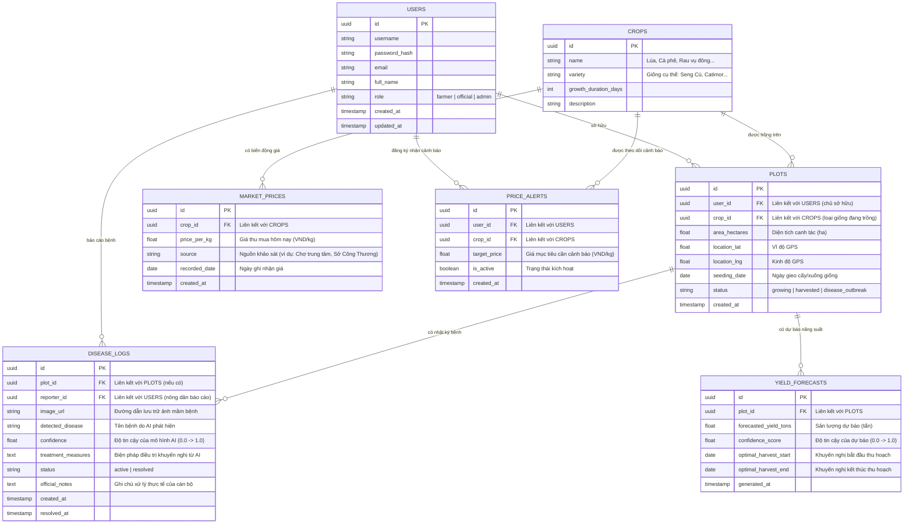

# 1.2 Thiết kế Cơ sở Dữ liệu (Database Schema) - ArgiAI

Tài liệu này đặc tả cấu trúc cơ sở dữ liệu quan hệ (PostgreSQL) phục vụ cho dự án ArgiAI, giúp hệ thống lưu trữ thông tin người dùng, mùa vụ, nhật ký bệnh hại, dự báo năng suất, giá cả thị trường và cấu hình nhận thông báo biến động giá.

---

## 1. Sơ đồ Quan hệ Thực thể (Entity Relationship Diagram - ERD)

---

## 2. Đặc tả các Bảng dữ liệu (Tables Specification)

### 2.1. Bảng `users` (Quản lý người dùng)
Lưu thông tin tài khoản của nông dân, cán bộ nông nghiệp và quản trị viên.

| Tên trường | Kiểu dữ liệu | Ràng buộc | Mô tả |
| :--- | :--- | :--- | :--- |
| `id` | `UUID` | PK, Default `uuid_generate_v4()` | ID duy nhất của người dùng. |
| `username` | `VARCHAR(50)` | UNIQUE, NOT NULL | Tên đăng nhập. |
| `password_hash`| `VARCHAR(255)`| NOT NULL | Mật khẩu đã được mã hóa (bcrypt/argon2). |
| `email` | `VARCHAR(100)` | UNIQUE, NULL | Địa chỉ email liên lạc. |
| `full_name` | `VARCHAR(100)` | NOT NULL | Họ và tên đầy đủ. |
| `role` | `VARCHAR(20)` | NOT NULL | Vai trò: `farmer` (nông dân), `official` (cán bộ), `admin` (quản trị). |
| `created_at` | `TIMESTAMP` | Default `NOW()` | Thời gian tạo tài khoản. |
| `updated_at` | `TIMESTAMP` | Default `NOW()` | Thời gian cập nhật tài khoản gần nhất. |

### 2.2. Bảng `crops` (Danh mục cây trồng)
Danh mục các cây trồng được hỗ trợ phân tích trong hệ thống.

| Tên trường | Kiểu dữ liệu | Ràng buộc | Mô tả |
| :--- | :--- | :--- | :--- |
| `id` | `UUID` | PK, Default `uuid_generate_v4()` | ID duy nhất của loại cây trồng. |
| `name` | `VARCHAR(100)` | NOT NULL | Tên cây trồng (ví dụ: Lúa, Cà phê, Rau vụ đông). |
| `variety` | `VARCHAR(100)` | NOT NULL | Giống cây trồng cụ thể (ví dụ: Seng Cù, Catimor, Cải ngọt). |
| `growth_duration_days` | `INTEGER` | NOT NULL | Chu kỳ sinh trưởng trung bình (số ngày). |
| `description` | `TEXT` | NULL | Mô tả thêm thông tin giống cây. |

### 2.3. Bảng `plots` (Khu đất canh tác)
Quản lý các mảnh ruộng/vườn của nông dân để phục vụ theo dõi năng suất và dịch bệnh.

| Tên trường | Kiểu dữ liệu | Ràng buộc | Mô tả |
| :--- | :--- | :--- | :--- |
| `id` | `UUID` | PK, Default `uuid_generate_v4()` | ID duy nhất của mảnh vườn/ruộng. |
| `user_id` | `UUID` | FK -> `users(id)`, NOT NULL | Chủ sở hữu mảnh đất (nông dân). |
| `crop_id` | `UUID` | FK -> `crops(id)`, NOT NULL | Loại cây giống đang trồng trên mảnh đất. |
| `area_hectares`| `DOUBLE PRECISION`| NOT NULL | Diện tích canh tác tính bằng hecta. |
| `location_lat` | `DOUBLE PRECISION`| NOT NULL | Vĩ độ địa lý GPS của thửa đất. |
| `location_lng` | `DOUBLE PRECISION`| NOT NULL | Kinh độ địa lý GPS của thửa đất. |
| `seeding_date` | `DATE` | NOT NULL | Ngày bắt đầu gieo hạt/xuống giống. |
| `status` | `VARCHAR(20)` | Default `'growing'` | Trạng thái: `growing` (đang trồng), `harvested` (đã thu hoạch), `disease_outbreak` (đang có dịch bệnh). |
| `created_at` | `TIMESTAMP` | Default `NOW()` | Thời gian tạo khu đất trên hệ thống. |

### 2.4. Bảng `disease_logs` (Nhật ký dịch bệnh)
Lưu trữ thông tin lịch sử phát hiện bệnh từ hình ảnh do nông dân chụp và phản hồi của cán bộ.

| Tên trường | Kiểu dữ liệu | Ràng buộc | Mô tả |
| :--- | :--- | :--- | :--- |
| `id` | `UUID` | PK, Default `uuid_generate_v4()` | ID duy nhất của nhật ký dịch bệnh. |
| `plot_id` | `UUID` | FK -> `plots(id)`, NULL | Khu đất bị bệnh (nếu nông dân đã định nghĩa). |
| `reporter_id` | `UUID` | FK -> `users(id)`, NOT NULL | Người chụp ảnh/báo cáo dịch bệnh. |
| `image_url` | `VARCHAR(255)` | NOT NULL | Đường dẫn lưu trữ ảnh bệnh phẩm trên Cloud Storage. |
| `detected_disease`| `VARCHAR(150)`| NOT NULL | Tên bệnh được phát hiện bởi mô hình AI. |
| `confidence` | `DOUBLE PRECISION`| NOT NULL | Độ tin cậy của dự đoán AI (0.0 đến 1.0). |
| `treatment_measures`| `TEXT`| NOT NULL | Biện pháp điều trị gợi ý tự động từ AI. |
| `status` | `VARCHAR(20)` | Default `'active'` | Trạng thái ổ dịch: `active` (đang xảy ra), `resolved` (đã khống chế xong). |
| `official_notes` | `TEXT` | NULL | Ghi chú cập nhật điều trị thực tế từ cán bộ nông nghiệp. |
| `created_at` | `TIMESTAMP` | Default `NOW()` | Thời điểm phát hiện bệnh. |
| `resolved_at` | `TIMESTAMP` | NULL | Thời điểm xử lý xong dịch bệnh. |

### 2.5. Bảng `yield_forecasts` (Dự báo năng suất)
Lưu thông tin dự báo sản lượng thu hoạch nông sản.

| Tên trường | Kiểu dữ liệu | Ràng buộc | Mô tả |
| :--- | :--- | :--- | :--- |
| `id` | `UUID` | PK, Default `uuid_generate_v4()` | ID duy nhất của bản ghi dự báo. |
| `plot_id` | `UUID` | FK -> `plots(id)`, NOT NULL | Khu đất được dự báo sản lượng. |
| `forecasted_yield_tons`| `DOUBLE PRECISION`| NOT NULL | Dự báo sản lượng nông sản thu hoạch (tấn). |
| `confidence_score`| `DOUBLE PRECISION`| NOT NULL | Độ tin cậy dự báo (0.0 đến 1.0). |
| `optimal_harvest_start`| `DATE`| NOT NULL | Ngày bắt đầu khuyến nghị thu hoạch (tính toán qua GDD). |
| `optimal_harvest_end`| `DATE`| NOT NULL | Ngày kết thúc khuyến nghị thu hoạch. |
| `generated_at` | `TIMESTAMP` | Default `NOW()` | Thời điểm tạo dự báo. |

### 2.6. Bảng `market_prices` (Biến động giá thị trường)
Lưu trữ thông tin giá cả nông sản khảo sát biến động hàng ngày.

| Tên trường | Kiểu dữ liệu | Ràng buộc | Mô tả |
| :--- | :--- | :--- | :--- |
| `id` | `UUID` | PK, Default `uuid_generate_v4()` | ID duy nhất của bản ghi giá nông sản. |
| `crop_id` | `UUID` | FK -> `crops(id)`, NOT NULL | Loại nông sản được khảo sát giá. |
| `price_per_kg` | `DOUBLE PRECISION`| NOT NULL | Giá bán thu mua ghi nhận (VND/kg). |
| `source` | `VARCHAR(150)` | NOT NULL | Nguồn thông tin khảo sát (chợ đầu mối, sở công thương...). |
| `recorded_date` | `DATE` | NOT NULL | Ngày ghi nhận mức giá. |
| `created_at` | `TIMESTAMP` | Default `NOW()` | Thời điểm đồng bộ dữ liệu vào hệ thống. |

### 2.7. Bảng `price_alerts` (Đăng ký nhận cảnh báo giá)
Lưu trữ các đăng ký nhận cảnh báo biến động giá từ phía nông dân.

| Tên trường | Kiểu dữ liệu | Ràng buộc | Mô tả |
| :--- | :--- | :--- | :--- |
| `id` | `UUID` | PK, Default `uuid_generate_v4()` | ID duy nhất của cấu hình cảnh báo. |
| `user_id` | `UUID` | FK -> `users(id)`, NOT NULL | Người đăng ký nhận cảnh báo. |
| `crop_id` | `UUID` | FK -> `crops(id)`, NOT NULL | Loại cây trồng cần theo dõi giá. |
| `target_price` | `DOUBLE PRECISION`| NOT NULL | Ngưỡng giá mục tiêu cần thông báo (VND/kg). |
| `is_active` | `BOOLEAN` | Default `TRUE` | Trạng thái kích hoạt gửi thông báo. |
| `created_at` | `TIMESTAMP` | Default `NOW()` | Thời điểm tạo cấu hình. |
