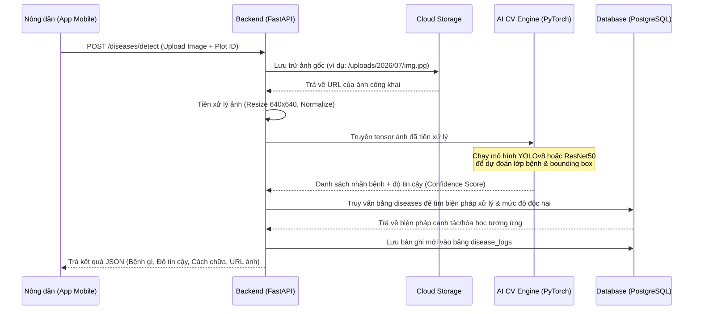
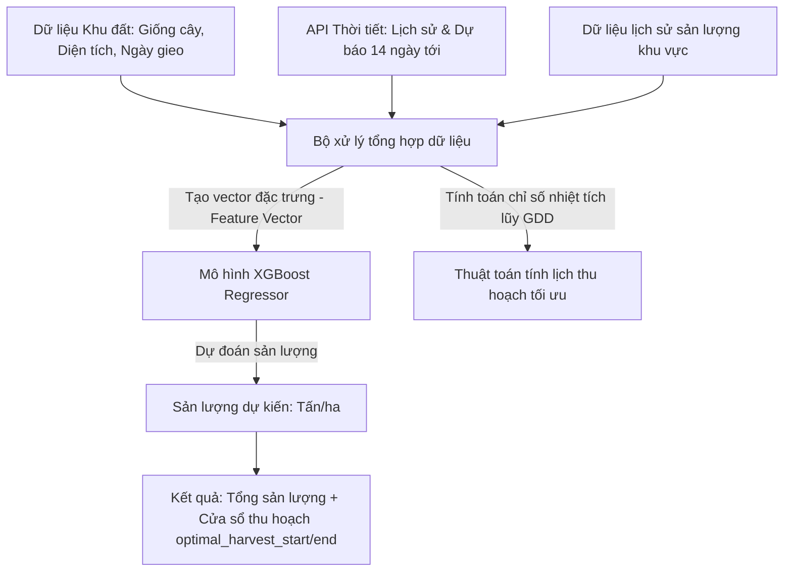
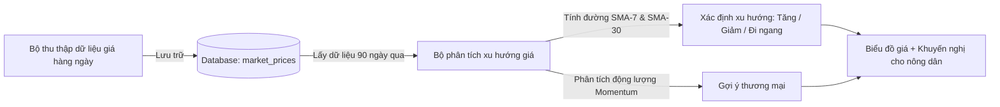

# 1.4 Đặc tả Luồng AI và Xử lý Dữ liệu (AI Pipeline) - ArgiAI

Tài liệu này đặc tả luồng xử lý dữ liệu và thuật toán AI trong hệ thống ArgiAI đối với 3 phân hệ chính: Nhận diện dịch bệnh, Dự báo năng suất & khuyến nghị thu hoạch, và Phân tích biến động giá thị trường.

---

## 1. Phân hệ Nhận diện Dịch bệnh Cây trồng (Crop Disease Detection)

Phân hệ này tiếp nhận ảnh chụp lá hoặc thân cây trồng từ nông dân, xử lý bằng mô hình học máy thị giác máy tính (Computer Vision) để nhận diện tên bệnh và trả về giải pháp điều trị.

### 1.1. Sơ đồ Luồng dữ liệu (Dataflow)

### 1.2. Đặc tả Kỹ thuật mô hình CV
- **Kiến trúc mô hình**: **YOLOv8** (cho bài toán phát hiện vật thể - Object Detection để khoanh vùng vết bệnh trên lá) hoặc **EfficientNet-B2** (cho bài toán phân loại ảnh - Image Classification nếu phân loại trên toàn khung ảnh).
- **Kích thước đầu vào (Input Shape)**: `[Batch_Size, 3, 640, 640]` hoặc `[Batch_Size, 3, 224, 224]`.
- **Danh sách nhãn đầu ra (Classes)**:
  - *Nhóm lúa*: Đạo ôn (Rice Blast), Bạc lá vi khuẩn (Bacterial Leaf Blight), Khô vằn (Sheath Blight), Khỏe mạnh (Healthy).
  - *Nhóm cà phê*: Gỉ sắt (Coffee Rust), Thối quả (Anthracnose), Khỏe mạnh (Healthy).
  - *Nhóm rau vụ đông*: Sâu tơ hại rau, Sương mai, Khỏe mạnh (Healthy).

---

## 2. Phân hệ Dự báo Năng suất & Lịch Thu hoạch (Yield Forecasting & Harvest Planning)

Dựa trên dữ liệu khí tượng lịch sử, dự báo thời tiết, loại giống cây trồng, diện tích canh tác và ngày gieo cấy để ước lượng sản lượng và đề xuất thời gian gặt hái tối ưu.

### 2.1. Sơ đồ Luồng dữ liệu (Dataflow)

### 2.2. Chi tiết Thuật toán & Đặc trưng (Features)
- **Công thức tích lũy nhiệt độ (Growing Degree Days - GDD)**:
  $$GDD = \sum \left( \frac{T_{max} + T_{min}}{2} - T_{base} \right)$$
  *Trong đó*:
    - $T_{base}$ là nhiệt độ ngưỡng tối thiểu của cây (Lúa: $10^\circ C$, Cà phê: $12^\circ C$).
    - $GDD$ tích lũy từ ngày gieo cấy giúp ước tính độ chín sinh lý của cây trồng rất chính xác.
- **Mô hình học máy dự báo năng suất**: **XGBoost Regressor** hoặc **Random Forest Regressor**.
- **Bộ đặc trưng đầu vào**:
  - `crop_variety_encoded`: Mã hóa One-Hot của giống cây (ví dụ: gạo Seng Cù, cà phê Catimor).
  - `area_hectares`: Diện tích.
  - `cumulative_gdd`: Tổng nhiệt lượng tích lũy thực tế từ lúc gieo cấy.
  - `average_humidity_past_30_days`: Độ ẩm trung bình.
  - `total_rainfall_past_30_days`: Tổng lượng mưa đo được.
  - `forecasted_rain_harvest_week`: Lượng mưa dự báo trong tuần dự định thu hoạch (để tránh ngày mưa to làm hỏng nông sản).

---

## 3. Phân hệ Phân tích Giá thị trường (Market Price Analysis)

Thu thập và phân tích chuỗi thời gian (Time-series) giá nông sản tại khu vực Điện Biên để đưa ra gợi ý bán nông sản hiệu quả nhất cho người nông dân.

### 3.1. Luồng dữ liệu & Phân tích xu hướng

### 3.2. Thuật toán phân tích xu hướng
Hệ thống sử dụng các chỉ số kỹ thuật tài chính cơ bản áp dụng cho nông sản:
- **Đường trung bình động đơn giản (SMA - Simple Moving Average)**:
  - **SMA-7 (Ngắn hạn)** và **SMA-30 (Dài hạn)**.
  - Nếu SMA-7 cắt lên trên SMA-30: Xu hướng giá tăng mạnh (Khuyến nghị giữ hàng chờ giá cao hơn).
  - Nếu SMA-7 cắt xuống dưới SMA-30: Xu hướng giá giảm (Khuyến nghị chuẩn bị bán sớm để tránh mất giá).
- **Tốc độ thay đổi giá (Rate of Change - ROC)**:
  $$ROC = \frac{Price_{t} - Price_{t-n}}{Price_{t-n}} \times 100$$
  Giúp đo lường đà tăng/giảm giá của nông sản để cảnh báo hiện tượng rớt giá đột ngột.
