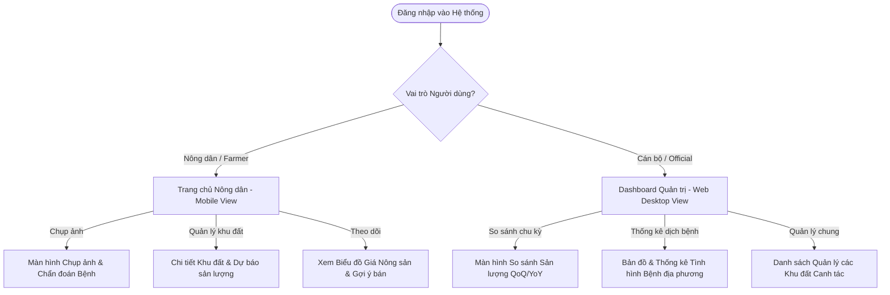

# 1.5 Thiết kế Giao diện & Luồng người dùng (UI/UX) - ArgiAI

Tài liệu này định nghĩa cấu trúc màn hình, bố cục (layout), luồng trải nghiệm người dùng (User Flow) và đặc tả chi tiết giao diện của các chức năng CRUD (Create, Read, Update, Delete) trong hệ thống ArgiAI.

---

## 1. Bản đồ Luồng người dùng (User Flow Map)

---

## 2. Đặc tả Giao diện ứng dụng Nông dân (Mobile View)

Ứng dụng hướng tới đối tượng người nông dân, yêu cầu giao diện đơn giản, trực quan, sử dụng màu xanh nông nghiệp hiện đại chủ đạo kết hợp các biểu tượng lớn.

### 2.1. Màn hình Trang chủ (Home Dashboard)
- **Bố cục (Layout)**:
  - *Header*: Lời chào ("Chào Bác Nguyễn Văn A!"), tên khu vực ("Mường Ảng, Điện Biên").
  - *Card Thời tiết*: Hiển thị nhiệt độ hiện tại, độ ẩm, và cảnh báo thời tiết cực đoan (nếu có).
  - *Lối tắt nhanh (Quick Actions)*: 
    - Nút lớn **"Chụp ảnh Bệnh cây"** màu xanh lá nổi bật có icon Camera.
    - Nút **"Dự báo Năng suất"** có icon biểu đồ cột.
  - *Bảng giá nông sản nhanh*: Hiển thị giá hôm nay của Gạo Điện Biên, Cà phê Mường Ảng kèm mũi tên tăng/giảm xanh/đỏ.

### 2.2. Màn hình Chẩn đoán Dịch bệnh (Crop Disease Camera)
- **Thành phần giao diện**:
  - Khung xem trước camera (Camera Preview) hoặc vùng kéo thả ảnh (Upload box).
  - Nút **"Phân tích ngay"** (hiển thị hiệu ứng sóng quét và xoay tròn spinner khi đang phân tích).
  - *Card Kết quả AI*:
    - **Tên bệnh**: In đậm, màu đỏ cảnh báo (Ví dụ: *Đạo ôn lúa*).
    - **Độ tin cậy**: Thanh phần trăm trực quan (Ví dụ: *Mức độ chính xác: 94%*).
    - **Biện pháp khuyến nghị**: Trình bày dưới dạng danh sách gạch đầu dòng rõ ràng, dễ đọc trực tiếp ngoài ruộng.

### 2.3. Màn hình Biến động Giá Nông sản
- **Thành phần giao diện**:
  - Ô chọn loại cây trồng (Dropdown): Gạo Seng Cù, Gạo tám Điện Biên, Cà phê Mường Ảng, Rau cải ngọt.
  - Bộ chọn khoảng thời gian (Tabs): `7 Ngày`, `30 Ngày`, `90 Ngày`.
  - **Biểu đồ đường (Line Chart)**: Thể hiện xu hướng tăng giảm giá.
  - **Khung tư vấn AI**: Hộp thoại văn bản ngắn gợi ý: *"Giá cà phê đang đạt đỉnh trong 3 tháng qua do thiếu cung cục bộ. Khuyến nghị bác nên chốt bán 70% sản lượng đang có."*

---

## 3. Đặc tả Giao diện Dashboard Cán bộ Quản lý (Web Desktop View)

Giao diện Web tối ưu hóa cho màn hình lớn (Desktop), sử dụng ngôn ngữ thiết kế **Glassmorphism/Sleek Dark Mode** hoặc **Clean Light Mode** mang lại cảm giác chuyên nghiệp cao cấp.

### 3.1. Trang chủ Dashboard Tổng quan (Overview)
- **Bên trái (Sidebar)**: Thanh điều hướng gồm: *Tổng quan*, *So sánh chu kỳ*, *Quản lý dịch bệnh*, *Quản lý khu đất*, *Cấu hình*.
- **Khu vực trung tâm**:
  - *Hàng Card chỉ số chính (KPIs)*:
    - Tổng diện tích gieo trồng (Hecta).
    - Sản lượng dự kiến toàn tỉnh (Tấn).
    - Số ca dịch bệnh đang hoạt động (Ổ dịch).
  - *Biểu đồ kết hợp (Combo Chart)*: Cột thể hiện diện tích, Đường thể hiện sản lượng theo từng xã/huyện.
  - *Bảng danh sách dịch bệnh khẩn cấp*: Liệt kê các ca báo cáo bệnh có độ chính xác cao và mức độ lây lan nhanh cần phê duyệt hỗ trợ.

### 3.2. Màn hình Báo cáo So sánh Chu kỳ (Period-Comparison Dashboard)
- **Thành phần bộ lọc (Filter bar)**:
  - Chọn Giống cây trồng.
  - Chọn Loại so sánh: `Quý này so với Quý trước (QoQ)` hoặc `So với cùng kỳ năm trước (YoY)`.
  - Nút **"Xuất Báo cáo"** (PDF/Excel) ở góc phải.
- **Khu vực Hiển thị Đồ thị**:
  - *Đồ thị 1: So sánh Diện tích canh tác (Barchart song song)*.
  - *Đồ thị 2: So sánh Sản lượng thu hoạch (Barchart song song)*.
  - *Đồ thị 3: Diễn biến số lượng ca dịch bệnh (Linechart so sánh hai mốc thời gian)*.
- **Bảng số liệu chi tiết**: Liệt kê số liệu cứng kèm cột phần trăm chênh lệch tăng/giảm ($\pm\%$) có màu sắc trực quan (tăng diện tích màu xanh lá, tăng số ca bệnh màu đỏ).

---

## 4. Đặc tả Chi tiết các Giao diện CRUD Dữ liệu (CRUD Screen Details)

Để đảm bảo AI hiểu rõ cấu trúc giao diện tương tác dữ liệu, phần này mô tả chi tiết giao diện danh sách (List), giao diện chi tiết (Detail) và các biểu mẫu nhập liệu (Form) cho 3 thực thể dữ liệu chính.

### 4.1. Thực thể 1: Khu đất Canh tác (Plots) - Hỗ trợ CRUD đầy đủ

#### A. Màn hình Danh sách Khu đất (Plots List Screen)
- **Vị trí**: Trang "/plots" trên cả Web (Cán bộ) và Mobile (Nông dân).
- **Các thành phần giao diện**:
  - **Bộ lọc (Filter Toolbar)**:
    - Ô tìm kiếm (Search Input): Tìm kiếm theo tên Nông dân hoặc giống cây.
    - Bộ chọn lọc Trạng thái (Dropdown Filter): Tất cả, Đang trồng (Growing), Đã thu hoạch (Harvested), Đang nhiễm bệnh (Disease Outbreak).
    - Nút **"+ Thêm Khu đất mới"**: Màu xanh chủ đạo (`#2E7D32`), đặt góc trên cùng bên phải.
  - **Bố cục hiển thị dữ liệu**:
    - *Trên Web Desktop*: Dạng Bảng (Table). Các cột: Nông dân sở hữu, Loại cây, Giống cụ thể, Diện tích (ha), Ngày xuống giống, Trạng thái (Dùng Badge màu: Xanh lá cho Growing, Xám cho Harvested, Đỏ cho Disease Outbreak), Hành động.
    - *Trên Mobile App*: Dạng Danh sách Thẻ (Card list). Mỗi thẻ thể hiện một khu đất với các thông số rút gọn, kèm icon đại diện loại cây trồng.
  - **Các nút hành động (Actions)**:
    - **Nút "Dự báo"** (Icon biểu đồ): Kích hoạt chạy dự báo AI cho mảnh đất đó.
    - **Nút "Sửa"** (Icon bút chì): Mở màn hình/modal chỉnh sửa.
    - **Nút "Xóa"** (Icon thùng rác màu đỏ): Hiển thị modal xác nhận *"Bạn có chắc chắn muốn xóa khu đất này không? Hành động này sẽ xóa toàn bộ lịch sử dịch bệnh và dự báo liên quan."*

#### B. Màn hình Biểu mẫu Thêm / Sửa Khu đất (Plot Form Screen - Create/Update)
- **Bố cục**: Giao diện Form dạng thẻ đơn giản (Single-column layout trên Mobile, Two-column trên Web Desktop).
- **Các trường dữ liệu đầu vào (Form Fields & Validation)**:
  1. **Loại cây trồng (Crop Type)** [Bắt buộc]: Dropdown select. Dữ liệu lấy từ danh mục `crops` (Lúa, Cà phê, Rau vụ đông).
  2. **Giống cây cụ thể (Variety)** [Bắt buộc]: Text input. Ví dụ: "Seng Cù", "Catimor". Giới hạn tối đa 100 ký tự.
  3. **Diện tích canh tác (Area)** [Bắt buộc]: Number input. Đơn vị: Hecta. Chỉ cho nhập số thực dương > 0. Hiển thị thông báo lỗi dưới trường nhập liệu nếu nhập sai: *"Diện tích phải lớn hơn 0"*.
  4. **Ngày xuống giống (Seeding Date)** [Bắt buộc]: Date Picker. Định dạng `DD/MM/YYYY`. Ràng buộc: Không cho phép chọn ngày trong tương lai.
  5. **Vị trí Địa lý (GPS Location)**:
     - 2 trường nhập số thực: Vĩ độ (Latitude) và Kinh độ (Longitude).
     - Nút **"Lấy vị trí hiện tại"** (Sử dụng GPS thiết bị di động).
     - Bản đồ nhỏ tích hợp (OpenStreetMap/Google Map) cho phép click để ghim tọa độ trực quan.
  6. **Trạng thái (Status)** [Chỉ hiển thị khi Sửa - Update]: Dropdown select (`growing`, `harvested`, `disease_outbreak`).
- **Nút bấm cuối trang**:
  - Nút **"Lưu lại"**: Màu xanh lá (`#2E7D32`), kích hoạt gửi request API POST (nếu Thêm mới) hoặc PUT (nếu Sửa).
  - Nút **"Hủy bỏ"**: Màu xám nhạt (`#757575`), quay lại màn hình danh sách mà không lưu thay đổi.

---

### 4.2. Thực thể 2: Nhật ký Dịch bệnh (Disease Logs) - Hỗ trợ CRUD đầy đủ

#### A. Màn hình Danh sách Nhật ký Dịch bệnh (Disease Logs List)
- **Vị trí**: Trang "/diseases" hoặc trong Tab con của Chi tiết khu đất.
- **Các thành phần giao diện**:
  - **Grid hiển thị ảnh**: Danh sách dạng lưới các ảnh chụp bệnh. Mỗi phần tử chứa ảnh nhỏ (Thumbnail), tên bệnh do AI đoán (ví dụ: *Đạo ôn lúa - 94%*), ngày chụp, và trạng thái xử lý (Badge màu: Đỏ cho "Đang xảy ra", Xanh dương cho "Đã xử lý").
  - **Nút chụp mới**: Nút trôi nổi (Floating Action Button - FAB) hình camera góc phải màn hình Mobile để chẩn đoán nhanh.
  - **Hành động**: Click vào phần tử để xem chi tiết.

#### B. Màn hình Chi tiết & Cập nhật Nhật ký Bệnh (Disease Log Detail & Edit Form)
- **Bố cục**: Chia làm 2 phần (Xem chi tiết kết quả AI và Form cập nhật trạng thái dập dịch).
- **Phần 1: Thông tin chẩn đoán từ AI (Xem chi tiết - Read)**:
  - Hiển thị ảnh gốc kích thước lớn (chế độ zoom xem chi tiết vết bệnh).
  - Khung kết quả: Tên bệnh, Độ tin cậy (Confidence), Mức độ nghiêm trọng gợi ý.
  - Khung hướng dẫn kỹ thuật điều trị (văn bản markdown định dạng danh sách).
- **Phần 2: Form cập nhật trạng thái (Update)**:
  - Trường **Trạng thái ổ dịch** [Bắt buộc]: Toggle switch hoặc Dropdown chọn giữa: `Đang diễn ra (Active)` và `Đã khống chế/Xử lý xong (Resolved)`.
  - Trường **Ngày xử lý xong (Resolved Date)**: Chỉ hiển thị khi chọn trạng thái `Resolved`. Mặc định chọn ngày giờ hiện tại.
  - Trường **Ghi chú điều trị thực tế (Notes)**: Textarea input. Cho phép người dùng nhập các loại thuốc thực tế đã phun, hoặc ghi nhận tình trạng phục hồi của cây.
- **Nút bấm**: Nút **"Cập nhật trạng thái"** (Màu xanh dương) và nút **"Xóa nhật ký"** (Màu đỏ, chỉ dành cho Cán bộ hoặc người tạo ra log trong trường hợp nhận diện sai).

---

### 4.3. Thực thể 3: Giá thị trường (Market Prices) - CRUD dành cho Cán bộ Quản lý

Thực thể này cho phép Nông dân xem dạng đồ thị (Read), cán bộ nông nghiệp có thể thêm, sửa, xóa dữ liệu giá hàng ngày để làm mốc tham chiếu cho toàn bộ hệ thống.

#### A. Màn hình Quản lý Giá Nông sản (Web Desktop view)
- **Bố cục**: Bảng quản lý (Data table) chiếm toàn bộ màn hình trung tâm.
- **Bộ lọc**: Lọc theo ngày gieo giá, lọc theo danh mục cây trồng. Nút **"Thêm giá hôm nay"** đặt góc phải.
- **Bảng dữ liệu (Table Columns)**:
  - `Tên loại cây` (ví dụ: Cà phê Mường Ảng Catimor).
  - `Mức giá (VND/kg)`.
  - `Nguồn thu thập` (ví dụ: Chợ đầu mối Điện Biên).
  - `Ngày áp dụng`.
  - `Thao tác`: Nút Sửa giá (Modal popup), Nút Xóa (Xác nhận xóa).

#### B. Modal/Form Thêm mới hoặc Cập nhật Giá (Price Form)
- Giao diện mở dạng hộp thoại (Modal popup) đè lên màn hình danh sách để tối ưu thao tác nhanh.
- **Các trường nhập liệu**:
  1. **Loại nông sản** [Bắt buộc]: Dropdown chọn loại cây trồng đã cấu hình trong DB.
  2. **Giá bán (VND/kg)** [Bắt buộc]: Number input. Chỉ cho phép nhập số nguyên dương. Tự động format hiển thị dấu phẩy hàng nghìn (ví dụ: `18,500`).
  3. **Nguồn thông tin** [Bắt buộc]: Text input. Gợi ý điền tên đơn vị khảo sát hoặc khu chợ đầu mối.
  4. **Ngày ghi nhận** [Bắt buộc]: Date Picker. Mặc định tự động điền ngày hôm nay.
- **Nút bấm**: "Xác nhận lưu" (Xanh lá) và "Hủy" (Trắng/Xám).
