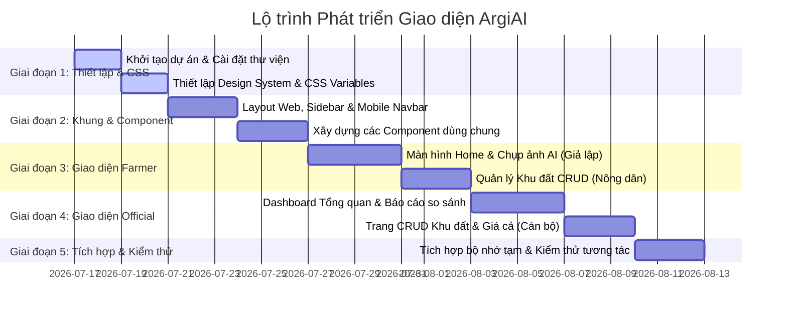

# 1.7 Kế hoạch Phát triển Giao diện (Frontend UI Development Plan) - ArgiAI

Tài liệu này vạch ra kế hoạch từng bước để xây dựng hoàn chỉnh giao diện người dùng (Frontend) của hệ thống ArgiAI bằng **React/Vite (TypeScript)** sử dụng dữ liệu giả lập (Mock Data) để chạy thử nghiệm đầy đủ các tính năng CRUD trước khi kết nối với Backend thực tế.

---

## 1. Phương pháp Triển khai (Methodology)
Để phát triển giao diện chạy độc lập (Standalone Frontend) không phụ thuộc vào Backend, chúng ta áp dụng:
1. **Mock Data Service**: Tạo các file JSON hoặc mảng dữ liệu giả lập có cấu trúc giống hệt định dạng của [1.3 Đặc tả API.md](file:///d:/Github/VAIC2026-ArgiAI/docs/1.3%20Đặc%20tả%20API.md).
2. **In-Memory State Management**: Sử dụng React Context và State để quản lý dữ liệu tạm thời. Các thao tác thêm, sửa, xóa (CRUD) sẽ trực tiếp thay đổi State này trong bộ nhớ trình duyệt, giúp người dùng tương tác như ứng dụng thật.
3. **Mock AI Engine Delay**: Tạo các hiệu ứng trễ (ví dụ: `setTimeout` 2 giây) khi bấm chẩn đoán bệnh cây hoặc chạy dự báo năng suất để giả lập thời gian xử lý thực tế của AI.

---

## 2. Kế hoạch Triển khai theo từng Giai đoạn (Phased Roadmap)

### 2.1. Giai đoạn 1: Thiết lập cấu trúc & Cấu hình thiết kế (Days 1 - 4)
- **Mục tiêu**: Thiết lập khung dự án chạy mượt mà, định nghĩa bảng màu và kiểu chữ chuyên nghiệp.
- **Công việc cụ thể**:
  1. Tổ chức thư mục theo chuẩn đặc tả tại [1.6 Hướng dẫn Cấu trúc Thư mục Code.md](file:///d:/Github/VAIC2026-ArgiAI/docs/1.6%20Hướng%20dẫn%20Cấu%20trúc%20Th%C6%B0%20m%E1%BB%A5c%20Code.md).
  2. Thiết lập `src/assets/index.css` với hệ thống biến màu sắc nông nghiệp (Green palette):
     - Chủ đạo (Primary): `#2E7D32` (Xanh lá nông nghiệp đậm)
     - Phụ trợ (Secondary): `#81C784` (Xanh lá sáng)
     - Cảnh báo (Danger): `#D32F2F` (Màu đỏ cho dịch bệnh)
     - Nền tối (Dark Background): `#121212` (dành cho chế độ tối)
  3. Cấu hình định tuyến (React Router) với các Route chính: `/login`, `/`, `/plots`, `/diseases`, `/prices`, `/compare`.

### 2.2. Giai đoạn 2: Xây dựng Component cốt lõi (Days 5 - 10)
- **Mục tiêu**: Tạo ra các viên gạch giao diện đầu tiên để ghép thành các trang.
- **Công việc cụ thể**:
  1. **Layout**:
     - *Sidebar (Web Desktop)*: Sidebar trượt mềm mại chứa logo và các menu điều hướng.
     - *Bottom Navigation (Mobile)*: Thanh điều hướng 4 nút dưới cùng màn hình tối ưu cho ngón cái của nông dân.
  2. **Components**:
     - *Card*: Thẻ chứa thông tin khu đất, thông tin thời tiết.
     - *Table*: Bảng dữ liệu có sẵn thanh phân trang (Pagination) và các cột thao tác CRUD.
     - *Charts*: Tích hợp thư viện biểu đồ nhẹ (như `Recharts` hoặc `Chart.js`) để vẽ biểu đồ đường giá và biểu đồ so sánh sản lượng cột.
     - *Modal*: Cửa sổ popup phục vụ việc xác nhận Xóa hoặc mở Form Thêm/Sửa nhanh.

### 2.3. Giai đoạn 3: Phát triển luồng chức năng cho Nông dân (Days 11 - 17)
- **Mục tiêu**: Hoàn thiện toàn bộ các trang giao diện trên di động của nông dân.
- **Công việc cụ thể**:
  1. **Trang chủ Mobile**: Hiển thị card thời tiết thực tế giả lập, các nút thao tác nhanh to rõ ràng.
  2. **Trang Chụp ảnh chẩn đoán bệnh**:
     - Cho phép tải lên file ảnh hoặc kích hoạt giả lập máy ảnh.
     - Hiện trạng thái loading sóng quét ảnh trong 2 giây.
     - Hiển thị kết quả chẩn đoán giả lập ngẫu nhiên các loại bệnh lúa/cà phê cùng biện pháp điều trị.
  3. **Trang Danh sách và Thêm/Sửa khu đất**:
     - Danh sách các thẻ khu đất.
     - Form thêm mới khu đất với đầy đủ các trường nhập dữ liệu địa lý, diện tích.

### 2.4. Giai đoạn 4: Phát triển luồng chức năng cho Cán bộ Quản lý (Days 18 - 24)
- **Mục tiêu**: Hoàn thiện Dashboard giám sát quy mô lớn trên Web Desktop.
- **Công việc cụ thể**:
  1. **Dashboard Overview**: Tích hợp các biểu đồ tổng hợp diện tích, sản lượng toàn địa bàn.
  2. **Dashboard So sánh Chu kỳ (Period Comparison)**:
     - Giao diện chọn quý, năm và giống cây.
     - Hiển thị biểu đồ cột song song so sánh QoQ/YoY sản lượng.
  3. **Bảng Quản lý CRUD Khu đất**:
     - Bảng hiển thị thông tin toàn bộ các khu đất canh tác của người dân.
     - Tích hợp tính năng kích hoạt dự báo năng suất trực tiếp trên dòng.
  4. **Bảng Quản lý CRUD Giá thị trường**:
     - Bảng theo dõi và chỉnh sửa giá cả nông sản.

### 2.5. Giai đoạn 5: Tích hợp Mock Service và Tương tác (Days 25 - 27)
- **Mục tiêu**: Gắn kết các trang với một kho lưu trữ dữ liệu tạm trong bộ nhớ (In-memory Storage) để toàn bộ tương tác CRUD hoạt động hoàn hảo.
- **Công việc cụ thể**:
  1. Tạo `src/context/AppContext.tsx` lưu trữ danh sách dữ liệu giả lập cho `plots`, `disease_logs`, `market_prices`.
  2. Viết các hàm:
     - `addPlot(plot)`, `updatePlot(id, plot)`, `deletePlot(id)`
     - `updateDiseaseStatus(id, newStatus)`
     - `addPrice(price)`, `deletePrice(id)`
  3. Liên kết các nút hành động trên giao diện với các hàm này để cập nhật trực tiếp giao diện khi người dùng Thêm/Sửa/Xóa.

---

## 3. Danh sách Mock Data cần chuẩn bị (`src/services/mockData.ts`)

Để phục vụ phát triển, chúng ta cần định nghĩa sẵn các bộ dữ liệu mẫu sau:
1. **`mockCrops`**: Danh sách giống cây mẫu (Lúa Seng Cù, Cà phê Catimor, Su hào Điện Biên).
2. **`mockPlots`**: Danh sách 5-10 khu đất mẫu ở khu vực Mường Ảng và TP. Điện Biên Phủ với diện tích và ngày gieo cấy khác nhau.
3. **`mockDiseaseLogs`**: Danh sách lịch sử các vụ nhiễm bệnh mẫu kèm theo đường dẫn ảnh mẫu (ảnh chụp lá lúa bị đạo ôn, quả cà phê thối,...).
4. **`mockMarketPrices`**: Lịch sử giá 30 ngày gần nhất của các loại nông sản chính.

---

## 4. Tiêu chí Xác thực Giao diện Đạt yêu cầu (Verification Criteria)
Sau khi hoàn thành code giao diện theo kế hoạch, Frontend phải vượt qua các bài thử nghiệm tương tác sau:
*   [ ] **Test Thêm mảnh đất**: Điền form -> Bấm Lưu -> Mảnh đất mới xuất hiện ở đầu danh sách.
*   [ ] **Test Sửa mảnh đất**: Bấm Sửa mảnh đất bất kỳ -> Thay đổi diện tích và trạng thái -> Bấm Lưu -> Thông tin hiển thị lập tức thay đổi.
*   [ ] **Test Xóa mảnh đất**: Bấm Xóa -> Modal cảnh báo hiện ra -> Xác nhận -> Mảnh đất biến mất khỏi danh sách.
*   [ ] **Test Chẩn đoán bệnh**: Tải ảnh lá lúa lên -> Bấm Phân tích -> Trạng thái loading quét ảnh hiển thị -> Sau 2 giây hiển thị đúng thông tin bệnh đạo ôn và biện pháp xử lý.
*   [ ] **Test Đổi trạng thái bệnh**: Mở chi tiết ca bệnh -> Đổi trạng thái từ "Đang diễn ra" sang "Đã xử lý" -> Bấm cập nhật -> Badge trạng thái trên màn hình chuyển sang màu xanh dương.
*   [ ] **Test So sánh chu kỳ**: Thay đổi bộ lọc từ QoQ sang YoY -> Biểu đồ so sánh sản lượng tự động cập nhật lại các cột số liệu.
